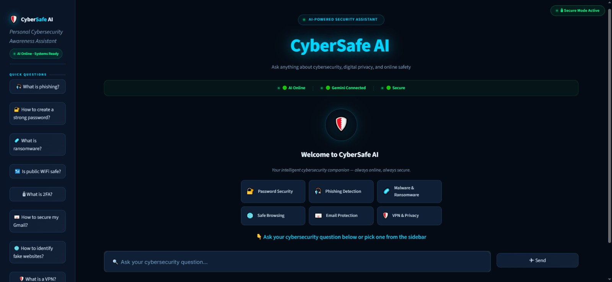
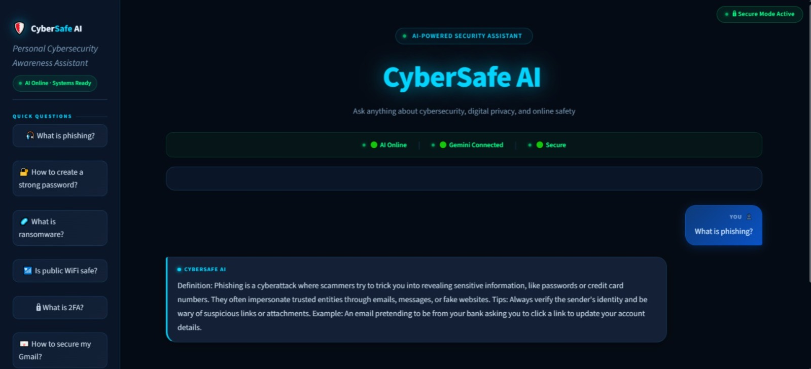
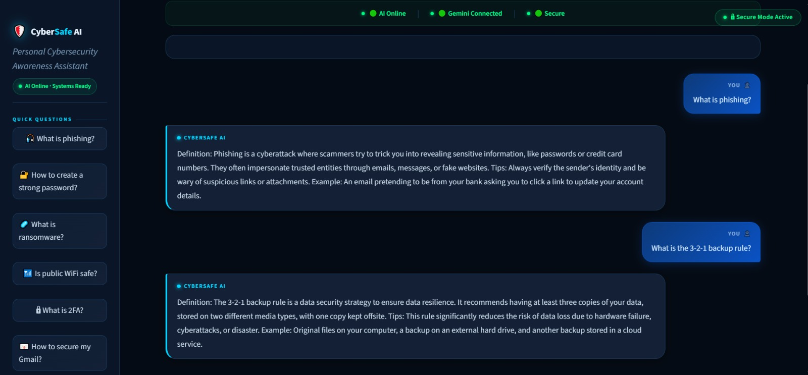
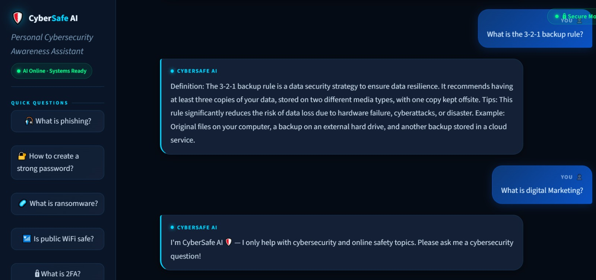
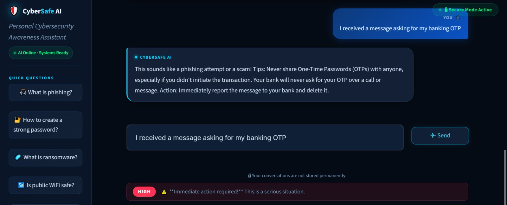

# 🛡️ CyberSafe AI

> Your Personal Cybersecurity Awareness Assistant

Built for **InnoViast Week 1 Assignment** — AI Solutions Engineering Track

🔗 **Live Demo:** https://cybersafeai.streamlit.app

---

## 🎯 What is CyberSafe AI?

CyberSafe AI is an intelligent chatbot that helps everyday users stay safe online. It answers cybersecurity questions in simple, beginner-friendly language.

---

## ✨ Features

- 🤖 AI-powered cybersecurity Q&A
- 🎨 Modern dark theme UI (mobile responsive)
- 🔴🟡🟢 Cyber Risk Level Checker
- 💡 Suggested question cards
- ⚠️ Smart error handling
- 🚫 Ethical boundaries — refuses hacking requests
- 📄 PDF knowledge base (50 FAQs)

---

## 🛠️ Tech Stack

- **Frontend:** Streamlit
- **Backend:** Python
- **AI Model:** Google Gemini 2.5 Flash Lite
- **Knowledge Base:** PDF FAQs (50 questions)
- **Libraries:** google-generativeai, python-dotenv, PyPDF2

---

## 🚀 Setup Instructions

### 1. Clone the repository

## 📸 Screenshots

### Welcome Screen

### Cybersecurity Q&A

### PDF Knowledge Base

### Out-of-Scope Handling

### Risk Checker
